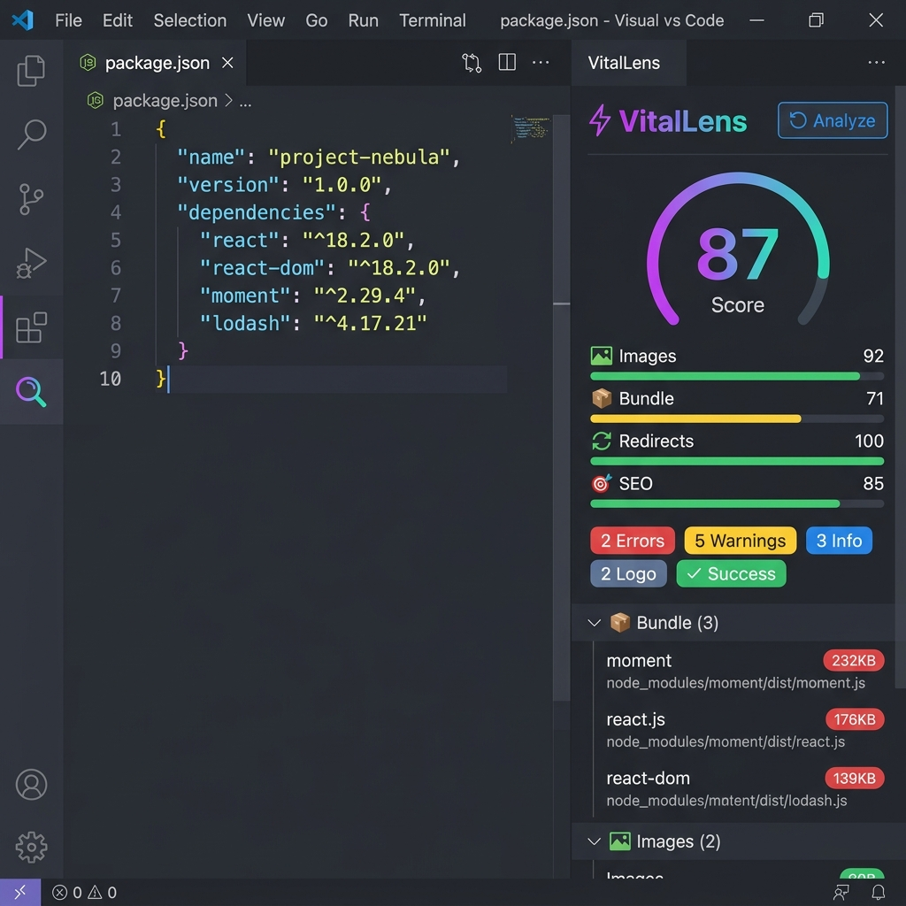
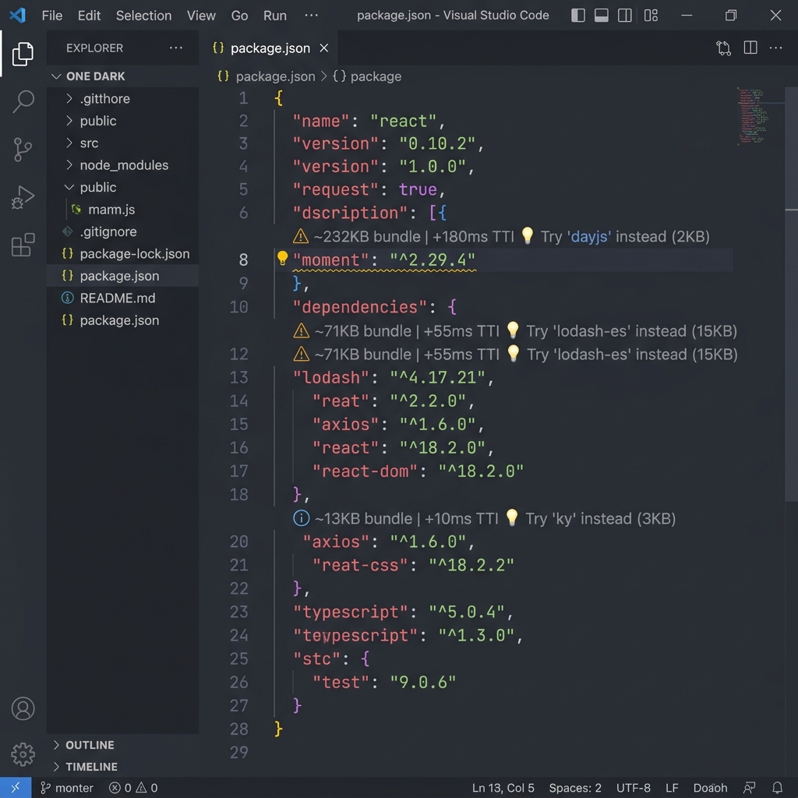
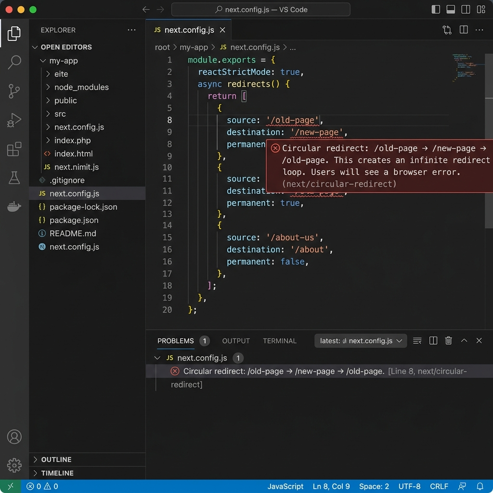

# VitalLens — Multi-Language SEO & PageSpeed Analyzer

> **The only VS Code extension that brings Lighthouse-style SEO and PageSpeed Insights audits directly into your editor.** Get real-time predictions of your Web Vitals and Semrush ranking scores for **Angular, React, Vue, Next.js, HTML, CSS, and JavaScript** while you write code.

---

## ⚡ Why VitalLens?

Most developers check page speed and search engine optimization (SEO) at the very end of their workflow. By then, refactoring heavy libraries or replacing poorly structured image templates is highly complex.

**VitalLens shifts SEO and Core Web Vitals audits directly into coding time.**
As you type, it highlights performance bottlenecks and SEO issues, showing:
1. **What code is the bottleneck** (via wavy lines/Diagnostics).
2. **What to use instead** (via inline CodeLenses above the line).
3. **The performance/SEO rationale** (the "Why").
4. **Instant refactoring** (via VS Code Quick Fix lightbulbs).

---

## 📸 Screenshots

### 📊 SEO & Core Web Vitals Predictor Panel

Open the **VitalLens Sidebar** in the Activity Bar to track:
- **0–100 Live Score** predicting your Lighthouse/PageSpeed results.
- **Predicted Core Web Vitals**: Real-time status checks for **LCP** (Largest Contentful Paint), **CLS** (Cumulative Layout Shift), and **INP** (Interaction to Next Paint).
- **Interactive Issue Log**: Collapsible lists grouped by Images, Bundles, Redirects, and SEO. Clicking any issue takes you directly to the code line.

---

### 📦 Bundle Weight CodeLens (package.json)

Instantly inspect the **bundle weight and TTI (Time to Interactive) impact** of every npm package directly above dependencies in `package.json`. Suggests lightweight alternatives (e.g. `moment` ➔ `dayjs`) in one click.

---

### 🔄 Redirect Loop & Cycle Detector (next.config.js)

Catch **infinite loops** and circular redirects in Next.js configurations. VitalLens models your redirect paths as a graph and alerts you immediately if a redirect chain will loop forever (A ➔ B ➔ C ➔ A).

---

## ✨ Supported Frameworks & Linter Rules

VitalLens detects PageSpeed and SEO violations across all major web file types:

### ⚛️ Next.js & React
- **Raw `` tags**: Warns and offers to replace with `<Image>` from `next/image` to prevent FCP/CLS issues.
- **Raw `<a>` tags**: Suggests replacing with `<Link>` to enable prefetching and client-side routing.
- **Dynamic Imports**: Recommends splitting heavy components (charts, maps) to reduce initial bundle weights.

### 🅰️ Angular
- **Raw `` tags**: Recommends using the `NgOptimizedImage` directive (`ngSrc`) to enforce preconnecting and proper sizing.
- **Raw `<a>` tags**: Detects internal links using href instead of `[routerLink]` (which trigger slow page reloads).
- **Defer Blocks**: Recommends Angular 17+ `@defer` blocks to load heavy components lazily.

### 🟢 Vue & Nuxt
- **Raw `` tags**: Suggests `<NuxtImg>` to apply automatic compression and responsive delivery.
- **Raw `<a>` tags**: Identifies internal navigation bypassing `<RouterLink>` or `<NuxtLink>`.

### 🌐 HTML (SEO & Metadata Audits)
- **Title Tag**: Warns if `<title>` is missing or empty (the single most important on-page SEO factor).
- **Meta Description**: Flags missing descriptions crucial for search engine CTR.
- **Viewport Config**: Alerts if viewport settings are missing (hurts Google's mobile-friendly indexation).
- **Canonical Link**: Detects missing canonical tags, preventing duplicate content ranking dilution.
- **Image alt attributes**: Warns on missing alt texts required for crawler indexing and WCAG accessibility.
- **Render-blocking Scripts**: Identifies scripts in `<head>` lacking `defer` or `async` tags.

### 🎨 CSS (Core Web Vitals - CLS & FCP)
- **Layout Shift Animations**: Detects animations on layout-affecting properties (width, height, top, left) which trigger browser reflows. Suggests animating `transform` instead to protect your CLS score.
- **Font-face swaps**: Flags missing `font-display: swap` inside `@font-face` rules (avoids blank text rendering on load).
- **CSS @import**: Flags imports blocking parallel downloads and delaying First Contentful Paint.

### ⚡ JavaScript & TypeScript
- **Synchronous XMLHttpRequests**: Flags sync requests that freeze the main thread and degrade TTI/INP scores.
- **Layout Thrashing**: Warns on repetitive write-read loops that force browser style recalculations.

---

## ⚙️ Configuration

Access settings under `Preferences ➔ Settings ➔ Extensions ➔ VitalLens`.

| Setting | Default | Description |
|---------|:-------:|-------------|
| `vitallens.enabled` | `true` | Enable/disable all VitalLens SEO & performance audits. |
| `vitallens.imageSizeWarningKB` | `200` | Size threshold in KB to trigger LCP warnings on images. |
| `vitallens.showCodeLens` | `true` | Show inline bundle size & SEO suggestions above code lines. |
| `vitallens.analyzeOnSave` | `true` | Re-run SEO analysis immediately on file save. |

---

## 🆚 How VitalLens Compares

| Feature | VitalLens | ESLint `next/core-web-vitals` | Lighthouse |
|---------|:---------:|:-----------------------------:|:----------:|
| Real-time in editor | ✅ | ✅ | ❌ |
| Multi-framework support | ✅ | ❌ | ✅ |
| Bundle size & TTI data | ✅ | ❌ | ❌ |
| Inline suggestions & Why | ✅ | ❌ | ❌ |
| Automatic Quick Fixes | ✅ | ❌ | ❌ |
| predicted Core Web Vitals | ✅ | ❌ | ❌ |
| Zero configuration | ✅ | ❌ | ✅ |

---

## 🐛 Issues & Feedback

Have a suggestion, bug report, or new rule idea?
Please open an issue or submit a pull request on our [GitHub Repository](https://github.com/irontoreofficial/vitallens).

If you find VitalLens useful, please leave a **5-star review** on the Marketplace! it helps the extension grow. ⭐⭐⭐⭐⭐

---

## 📄 License

MIT © [Irontore](https://irontore.com)
